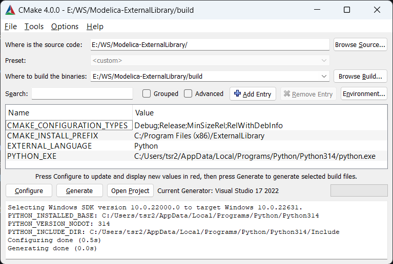
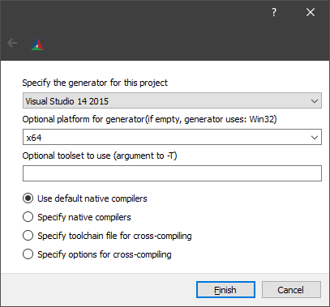
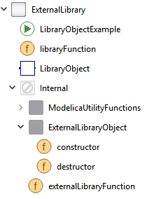

# Modelica ExternalLibrary

"ExternalLibrary" is a Modelica library that demonstrates how to call external C/C++ and Python code from Modelica. It implements a function that reads a double value from a text file, adds it to the inputs and returns the result:

```
(y1, y2) = externalFunction(filename, u1, u2)
```

This function can easily be adapted to different use cases e.g. pre-processing, data loading or inter- and extrapolation using C/C++ and Python libraries. The Modelica library and C interface of the shared library is the same for both backends.

## Prerequisites

The library should also work with other versions, platforms and compilers but for simplicity we assume the following programs to be installed:

- Visual Studio 2017
- Dymola 2022
- CMake 3.15
- Anaconda Python 3.8 64-bit (only required for the Python backend)

## Project structure

- `C` - C/C++ headers and sources of the shared library
- `ExternalLibrary` - the Modelica package
- `Python` - the Python library

## Building the C++ library



- open the CMake GUI
- click `Browse Source...` and select the root of the repository
- create a sub-directory `build`, click `Browse Build...` and select it
- click `Configure` and select Visual Studio as generator and `x64` as platform



- click `Generate` to generate the Visual Studio solution
- click `Open Project` to open the solution in Visual Studio
- build the solution (`CRTRL+SHIFT+B`)

The shared library is automatically copied to `ExternalLibrary/Resources/Library/win64/ExternalLibrary.dll`.

To run the tests, right click on the `ExternalLibraryTest` project, select `Set as StartUp project` and press `F5` to run it. In the `Output` window you should get a return code of `0` if the test ran successfully.

## Building the Python library

To build a shared library that calls Python follow the steps above, but after you pressed `Configure`, select `EXTERNAL_LANGUAGE=Python` and set `PYTHON_HOME=C:/Anaconda3` (assuming that you installed Anaconda Python 3.7 in `C:/Anaconda3`).

To install the Python library in development mode run `pip install -e Python` in the root of the repository.
This will allow you edit the Python code without reinstalling the library.

In order use load the Python binaries and their dependencies two environment variables need to be for the process loading the `ExternalLibrary.dll`.

`PYTHONHOME` needs to point to the folder that contains the Python executable.
It can retrieved by running `which python`.

`PATH` needs to contain all folders that contain Python binaries and dependencies.
For Conda environments these can be retrived by running `set PATH` inside a Conda prompt.

On the `ExternalLibraryTest` project in Visual Studio right-click and selct `Properties > Configuration Properties > Debugging`.
In `Environment` set the two environment variables and run the project to check if everything is set up correctly.

## Renaming the shared library

To change the name of the shared library, rename the target for the copy command in `CMakeLists.txt`

```cmake
add_custom_command(TARGET ExternalLibrary POST_BUILD COMMAND ${CMAKE_COMMAND} -E copy
  "$<TARGET_FILE:ExternalLibrary>"
  "${CMAKE_CURRENT_SOURCE_DIR}/ExternalLibrary/Resources/Library/${MODELICA_PLATFORM}/${CMAKE_SHARED_LIBRARY_PREFIX}MyExternalLibrary${CMAKE_SHARED_LIBRARY_SUFFIX}"

)
#                                                                                                                   ^^^^^^^^^^^^^^^^^
```

and change all references in the Modelica library accordingly

```Modelica
annotation (Library="MyExternalLibrary");
//                   ^^^^^^^^^^^^^^^^^
```

## Modelica library

The Modelica library is the same for both the C++ and the Python backend.
It contains a Modelica function `libraryFunction` that can be used e.g. to load data at the beginning of a simulation and an ExternalObject `LibraryObject` to connect to external code during the simulation (e.g. to inter- or extrapolate using special algorithms).



After loading the `ExternalLibrary` package in Dymola, go to `Commands` and run `Advanced.CompileWith64=2` to compile 64-bit binaries and `Modelica.Utilities.System.setEnvironmentVariable("PYTHONHOME", ...)`  and `Modelica.Utilities.System.setEnvironmentVariable("PATH", ...)` (see previous section), so the shared library knows where to search for the Python installation and dependencies.

To run the function with the default parameters, right click `externalLibraryFunction` and select `Run Function...` and then `Execute`.

The `ExternalLibraryFunctionExample` and `ExternalLibraryObjectExample` demonstrates the use of the external function and object respectively.

## License

Copyright &copy; 2024 Dassault Syst&egrave;mes.
The code is released under the [2-Clause BSD license](LICENSE.txt).
