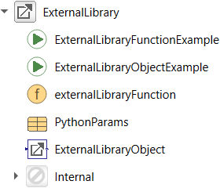

# Modelica ExternalLibrary

"ExternalLibrary" is a Modelica library that demonstrates how to call external C/C++ and Python code from Modelica. It implements a function that reads a double value from a text file, adds it to the inputs and returns the result:

```
(y1, y2) = externalFunction(filename, u1, u2)
```

This function can easily be adapted to different use cases e.g. pre-processing, data loading or inter- and extrapolation using C/C++ and Python libraries. The Modelica library and C interface of the shared library is the same for both backends.

## Prerequisites

The library should also work with other versions, platforms and compilers but for simplicity we assume the following programs to be installed:

- Visual Studio 2015
- Dymola 2020
- CMake 3.15
- Anaconda Python 3.7 64-bit (only required for the Python backend)

## Project structure

- `C` - C/C++ headers and sources of the shared library
- `ExternalLibrary` - the Modelica package
- `Python` - the Python library

## Building the C++ library


- open the CMake GUI
- click `Browse Source...` and select the root of the repository
- create a sub-directory `build`, click `Browse Build...` and select it
- click `Configure` and select Visual Studio as generator and `x64` as platform


- click `Generate` to generate the Visual Studio solution
- click `Open Project` to open the solution in Visual Studio
- build the solution (`CRTRL+SHIFT+B`)

The shared library is automatically copied to `ExternalLibrary/Resources/Library/win64/ExternalLibrary.dll`.

To run the tests, right click on the `ExternalLibraryTest` project, select `Set as StartUp project` and press `F5` to run it. In the `Output` window you should get a return code of `0` if the test ran successfully.

## Building the Python library

To build a shared library that calls Python follow the steps above, but after you pressed `Configure`, select `EXTERNAL_LANGUAGE=Python` and (assuming that you installed Anaconda Python 3.7 in `C:/Anaconda3`) set `PYTHON_HOME=C:/Anaconda3`, `PYTHON_INCLUDE_DIR=C:/Anaconda3/include` and `PYTHON_LIBRARY=C:/Anaconda3/libs/python37.lib`.

To install the Python library in development mode run `pip install -e Python` in the root of the repository. This will allow you edit the Python code without reinstalling the library.

Run `ExternalLibraryTest` in Visual Studio to check if everything is set up correctly.

## Modelica library

The Modelica library is the same for both the C++ and the Python backend. It contains a Modelica function `libraryFunction` that can be used e.g. to load data at the beginning of a simulation and an ExternalObject `LibraryObject` to connect to external code during the simulation (e.g. to inter- or extrapolate using special algorithms).



After loading the `ExternalLibrary` package in Dymola, go to `Commands` and run `Advanced.CompileWith64=2` to compile 64-bit binaries and `Modelica.Utilities.System.setEnvironmentVariable("PYTHONHOME", "C:/Anaconda3")`, so the shared library knows where to search for the Python installation.

To run the function with the default parameters, right click `libraryFunction` and select `Run Function...` and then `Execute`.

The `LibraryObjectExample` demonstrates the use of the external object.

## License

Copyright &copy; 2019 Dassault Syst&egrave;mes.
The code is released under the [2-Clause BSD license](LICENSE.txt).
